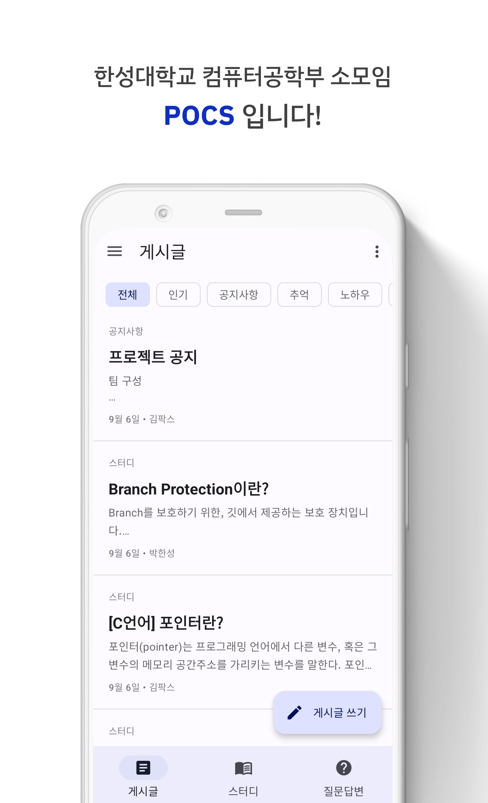
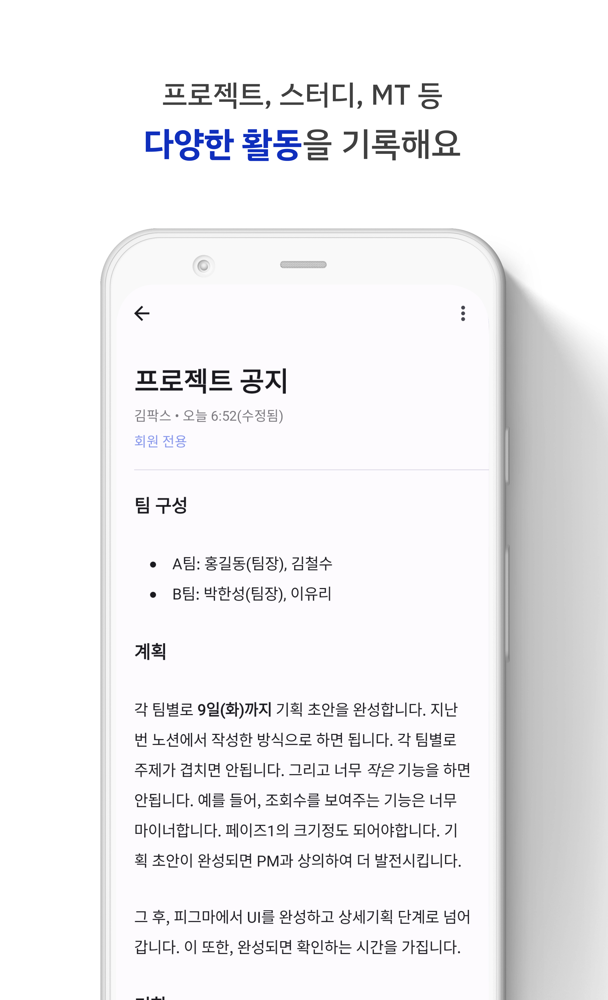
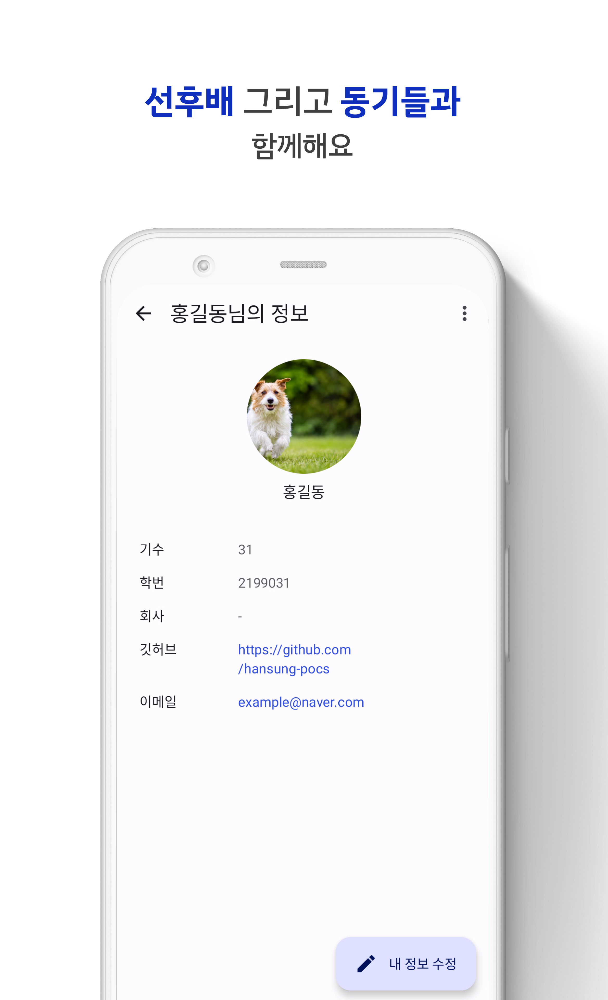
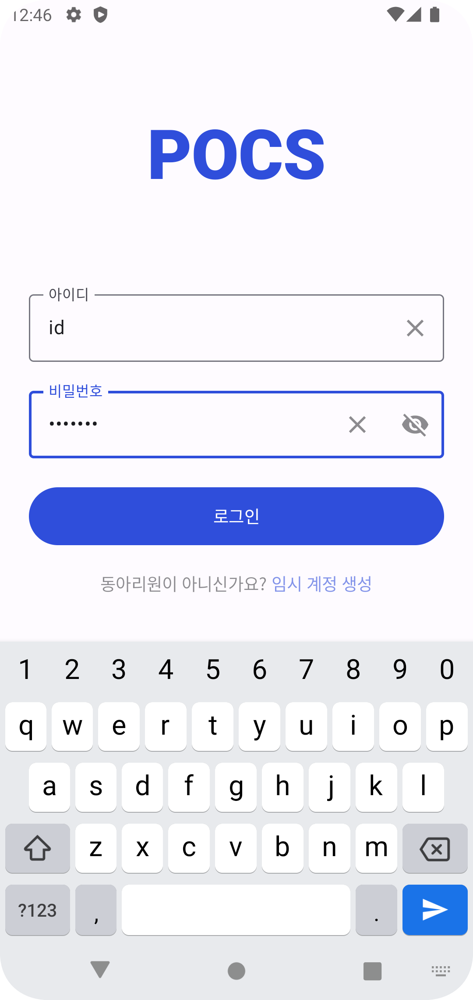
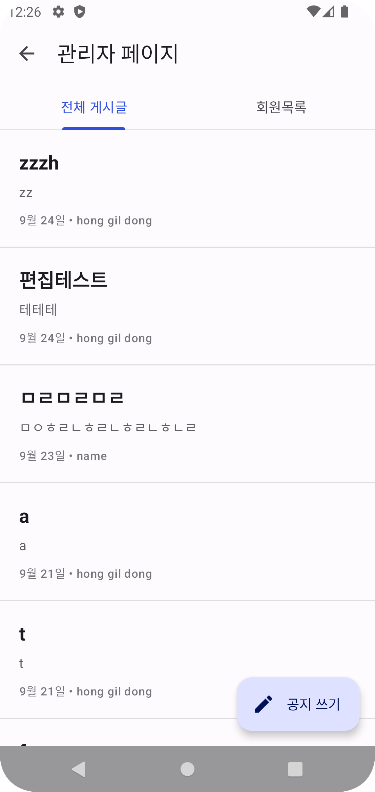
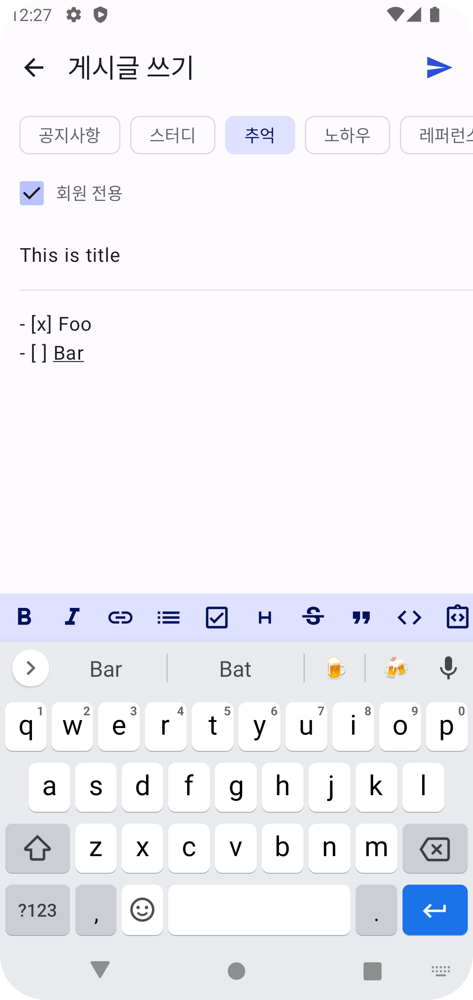

# blog-android

한성대학교 소모임 POCS의 블로그 앱입니다.

# 스크린샷

| 홈                                          | 게시글                                        | 회원프로필                                                      |
|--------------------------------------------|--------------------------------------------|------------------------------------------------------------|
|  |  |  |

| 로그인                                          | 관리자                                          | 게시글작성                                                |
|----------------------------------------------|----------------------------------------------|------------------------------------------------------|
|  |  |  |

# 기술

- Coroutine
- Paging
- View Binding
- ViewModel
- Compose
- Hilt
- Glide
- Retrofit
- Room
- Github Action(CI/CD)

# [위키 페이지](https://github.com/hansung-pocs/blog-android/wiki)

# [프로덕트 백로그](https://github.com/orgs/hansung-pocs/projects/1)

