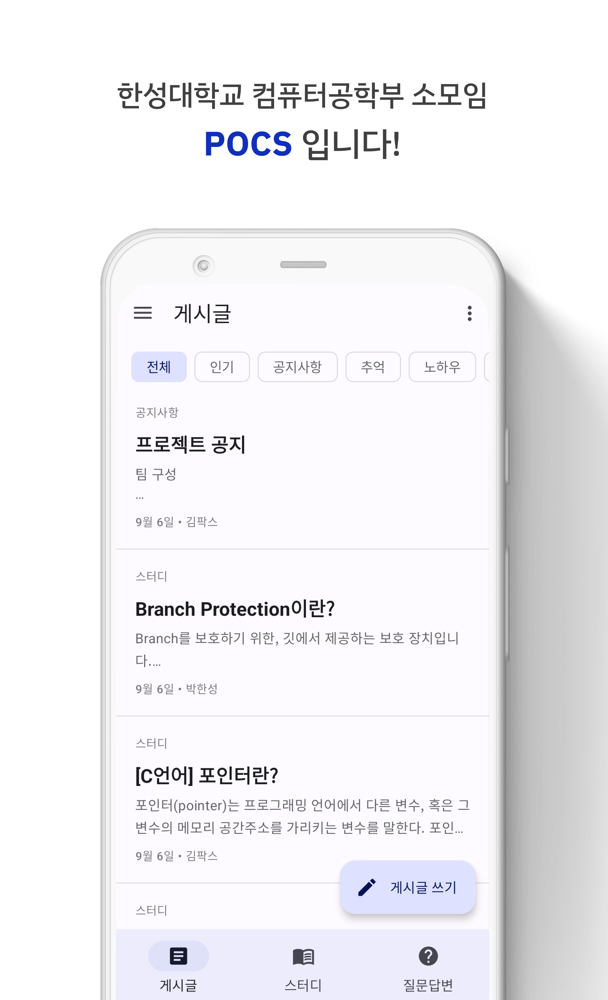
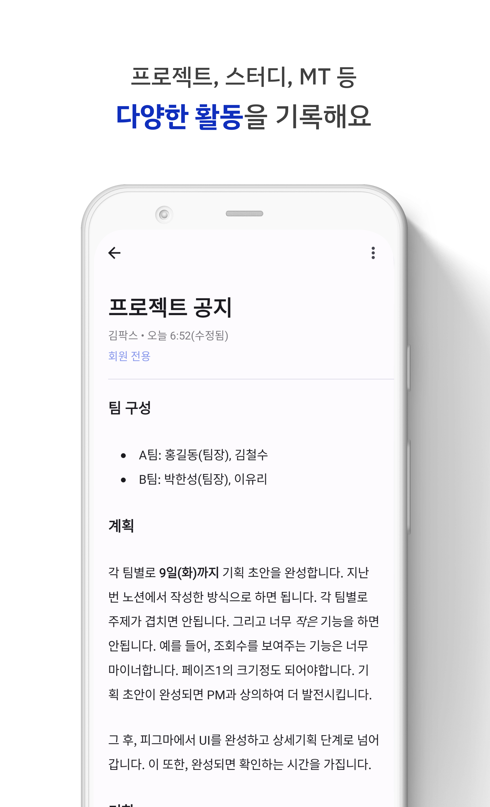
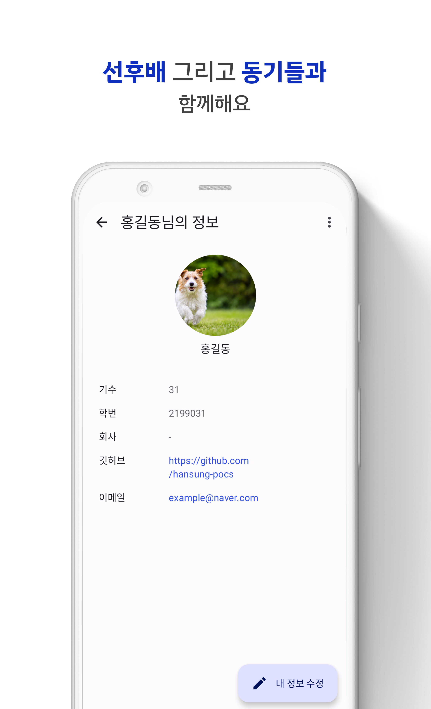
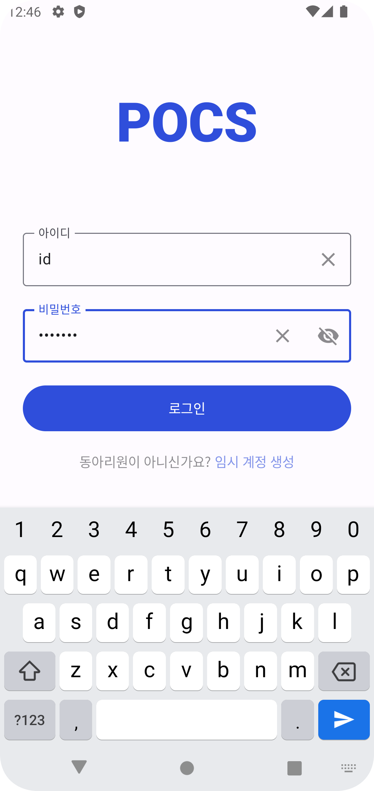
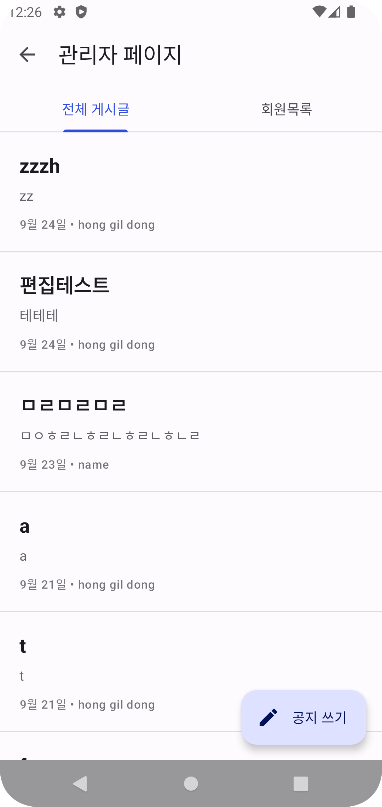
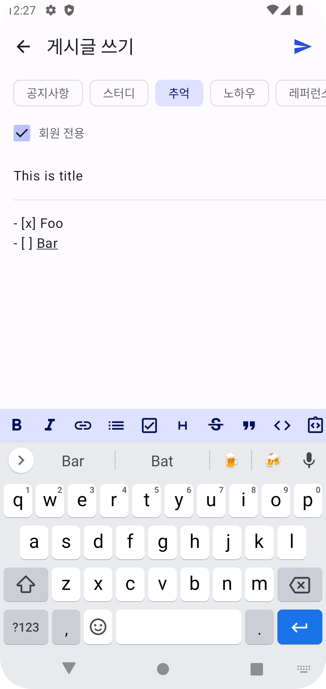
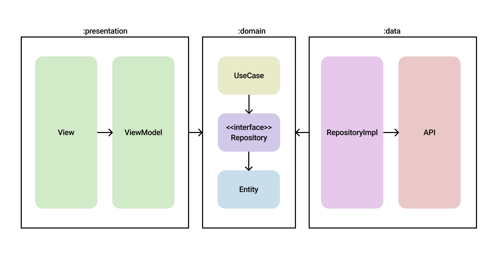

# POCS - Android App

한성대학교 소모임 POCS의 블로그 앱입니다. 우리의 미션은 회원들이 모바일에서 쉽게 소모임 정보를 공유하고 수집할 수 있도록 도와주는 것입니다.

# 스크린샷

| 홈                                   | 게시글                                 | 회원프로필                                               |
|-------------------------------------|-------------------------------------|-----------------------------------------------------|
|  |  |  |

| 로그인                                   | 관리자                                   | 게시글작성                                         |
|---------------------------------------|---------------------------------------|-----------------------------------------------|
|  |  |  |

# 아키텍처

# 기술

- Coroutine
- Paging3
- View Binding
- ViewModel
- Compose
- Hilt
- Dagger
- Glide
- Retrofit2
- OkHttp3
- Espresso
- Github Action(CI/CD)

# [위키 페이지](https://github.com/hansung-pocs/blog-android/wiki)

# [프로덕트 백로그](https://github.com/orgs/hansung-pocs/projects/1)

